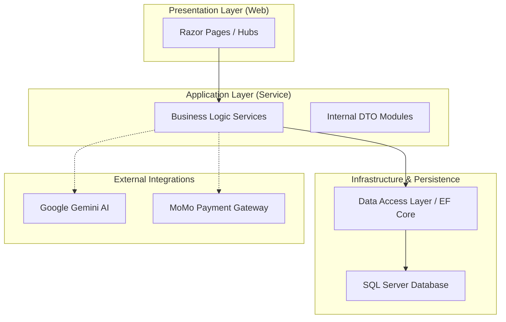

# Technical Documentation: School Management System (PRN222 Final Project)

## 1. PROJECT OVERVIEW

The School Management System is a centralized platform designed to digitize and automate academic and administrative processes within an educational institution. The system facilitates the management of student records, faculty assignments, course registrations, grading workflows, and financial transactions. 

Core functionalities identified within the codebase include:
*   **Identity Management**: Secure authentication and authorization for Students, Teachers, and Administrators.
*   **Academic Administration**: Management of programs, courses, semesters, and class sections.
*   **Grade Management**: A structured gradebook system supporting weighted assessments, audit logs, and appeal processes.
*   **Real-time Communication**: Chat modules and notification systems for academic coordination.
*   **Integrated Finance**: Student wallet management with MoMo Payment Gateway integration for tuition settlement.
*   **Intelligent Assistance**: AI-driven support and analytics integrated via Google Gemini.

---

## 2. SYSTEM ARCHITECTURE

### 2.1 Architectural Pattern

The system implements a Modular Layered Architecture, adhering to the principles of separation of concerns and maintainability. It is structured into four distinct layers that follow a strict dependency flow:

1.  **Presentation Layer** (UI/Web)
2.  **Business Logic Layer** (Service/Application)
3.  **Data Access Layer** (Persistence)
4.  **Business Object Layer** (Shared Entities)

### 2.2 Architecture Explanation

*   **Presentation Layer (`Presentation`)**: Implemented using ASP.NET Core Razor Pages. This layer handles HTTP requests, manages user sessions via cookie authentication, and renders the user interface. It also hosts SignalR Hubs for real-time features.
*   **Business Logic Layer (`BusinessLogic`)**: Contains the core application logic, service interfaces, and implementations. It serves as an intermediary, processing data from the Presentation Layer before interacting with the Data Access Layer. It also manages integrations with external APIs like Gemini and MoMo.
*   **Data Access Layer (`DataAccess`)**: Responsible for data persistence and retrieval. It utilizes Entity Framework Core for Object-Relational Mapping (ORM) and implements the Repository pattern to abstract database operations.
*   **Business Object Layer (`BusinessObject`)**: Defines the domain models, database entities, and shared enumerations used across all layers.

### 2.3 Architecture Diagram



---

## 3. PROJECT STRUCTURE

The solution directory is organized as follows:

*   **`Presentation/`**: Entry point of the application. Contains the Razor Pages, Middleware, SignalR Hubs, and static assets (`wwwroot`).
*   **`BusinessLogic/`**: Core services (`Services`), Data Transfer Objects (`DTOs`), and configuration settings.
*   **`DataAccess/`**: Repository implementations and the `SchoolManagementDbContext` for SQL Server interaction.
*   **`BusinessObject/`**: Centralized definitions for Database Entities and Enums.
*   **`PRN222_G5_finalproject.sql`**: Comprehensive T-SQL script for database schema initialization and data seeding.

---

## 4. TECHNOLOGY STACK

*   **Frontend**: ASP.NET Core Razor Pages, JavaScript, SignalR (WebSockets).
*   **Backend**: .NET 8.0, C#.
*   **Database**: SQL Server 2019+ (Express/LocalDB/Standard).
*   **ORM**: Entity Framework Core 8.0.
*   **Security**: Cookie Authentication, BCrypt Password Hashing.
*   **Documentation & Reporting**: Mermaid.js, CSV/XSLX Export Libraries.

---

## 5. SYSTEM FLOW

1.  **Request Initiation**: The user interacts with the Presentation Layer via a browser.
2.  **Authentication/Authorization**: Middleware validates the user's session and role permissions.
3.  **Service Invocation**: The Presentation Layer calls the appropriate Service within the Business Logic Layer.
4.  **Data Processing**: The Service performs business validation, external API calls (if required), and prepares data for persistence.
5.  **Persistence**: The Service interacts with Repositories in the Data Access Layer to perform CRUD operations via EF Core.
6.  **Response Delivery**: The results are returned through the layers to the user as a rendered page or real-time SignalR update.

---

## 6. ENVIRONMENT CONFIGURATION

The system configuration is managed via `Presentation/appsettings.json`. The following parameters are required:

```json
{
  "ConnectionStrings": {
    "DefaultConnection": "Server=...;Database=SchoolManagementDb;..."
  },
  "MoMo": {
    "PartnerCode": "MOMO",
    "AccessKey": "...",
    "SecretKey": "...",
    "Endpoint": "..."
  },
  "Gemini": {
    "ApiKey": "...",
    "Model": "gemini-..."
  }
}
```

---

## 7. INSTALLATION AND SETUP GUIDE

### Step 1: Clone the Repository
Clone the source code to your local development environment:
```bash
git clone https://github.com/PRN222-SE1815/PRN222-FinalProject.git
cd PRN222-FinalProject
```

### Step 2: Database Initialization
1.  Open **SQL Server Management Studio (SSMS)** or your preferred SQL tool.
2.  Execute the script provided in `PRN222_G5_finalproject.sql`. This will create the `SchoolManagementDb` and populate it with required seed data.

### Step 3: Application Configuration
Navigate to the `Presentation` directory and locate `appsettings.json`. Update the `DefaultConnection` string to match your SQL Server instance:
*   Example: `Server=.;Database=SchoolManagementDb;Integrated Security=True;TrustServerCertificate=True;`

### Step 4: Dependency Restoration
Restore all NuGet packages required for the solution:
```bash
dotnet restore
```

### Step 5: Execute Application
Run the web application from the root directory or the Presentation folder:
```bash
dotnet run --project Presentation
```
The application will be available at the URL provided in the console (typically `http://localhost:5000` or `https://localhost:7001`).

---

## 8. SAMPLE DATA AND USAGE

Upon successful execution, the following test accounts can be used for system verification:

| Account Role | Username | Password |
| :--- | :--- | :--- |
| **Administrator** | `admin` | `123456` |
| **Teacher** | `teacher1` | `123456` |
| **Student** | `student1` | `123456` |

*Note: Passwords in the database are hashed using BCrypt. The plaintext value `123456` is standard for all seed accounts.*

---

## 9. AVAILABLE SCRIPTS

*   **`dotnet build`**: Compiles the solution and all its projects.
*   **`dotnet run`**: Launches the web server.
*   **`dotnet test`**: Executes unit and integration tests (if implemented).
*   **`dotnet publish -c Release`**: Prepares the application for deployment.

---

## 10. TROUBLESHOOTING

*   **Database Connection Issues**: Verify that the SQL Server service is active and that the connection string in `appsettings.json` is accurate. If using a named instance, ensure it is included (e.g., `.\SQLEXPRESS`).
*   **NuGet Package Restoration**: If build errors occur, try deleting the `bin` and `obj` folders and running `dotnet restore` again.
*   **HTTPS Certificate**: For local development, you may need to trust the dev certificate by running `dotnet dev-certs https --trust`.
*   **External API Errors**: Ensure valid API keys for MoMo and Gemini are provided in the configuration if those modules are being tested.
