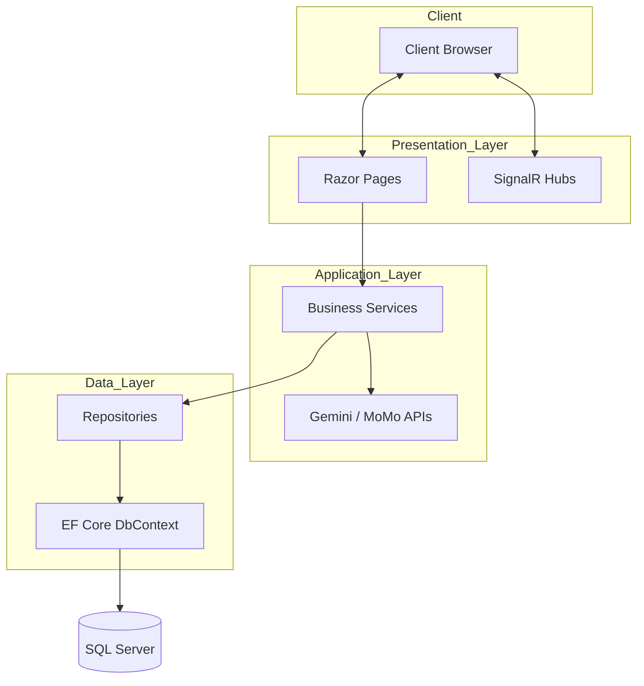

# School Management System (PRN222 Final Project)

## 1. Overview

This project is a comprehensive School Management System built with .NET 8. It provides a centralized platform for managing academic operations, including student registration, course scheduling, grading workflows, and real-time communication between students and faculty.

### Key Capabilities
*   **Academic Management**: Enroll students, assign teachers to class sections, and manage semester-based course offerings.
*   **Gradebook Lifecycle**: Support for weighted grading, audit logging, and automated weighted total calculation.
*   **Real-time Interaction**: Integrated chat rooms for courses/classes and instant notifications via SignalR.
*   **Financial Integration**: Student wallet management with MoMo Payment Gateway support for tuition payments.
*   **AI-Enhanced Features**: Automated analysis and assistance modules powered by Google Gemini AI.

---

## 2. Architecture

### 2.1 High-level Design

The system is implemented using a 4-project structure that logically maps to a 3-layer architecture pattern:

*   **Presentation Layer (`Presentation`)**: ASP.NET Core Razor Pages that handle HTTP requests, session management (Cookie Auth), and SignalR hub coordination.
*   **Application Layer (`BusinessLogic`)**: Contains domain services that execute business rules, orchestrates data between the presentation and data layers, and handles external API integrations (Gemini, MoMo).
*   **Data Layer (`DataAccess`)**: Implements the Repository pattern using Entity Framework Core to manage SQL Server persistence.
*   **Domain Layer (`BusinessObject`)**: Defines shared entities, enums, and data models used across all layers.

### 2.2 Data Flow

1.  **Request**: User interacts with a Razor Page (UI).
2.  **Service**: The Page Model invokes a method in a corresponding `Service` class.
3.  **Repository**: The Service performs business validation and calls a `Repository` method.
4.  **Database**: The Repository interacts with `SchoolManagementDbContext` to perform SQL operations.
5.  **Return**: Data flows back up through the layers, potentially triggering real-time SignalR updates before rendering the final view.

### 2.3 Architecture Diagram



---

## 3. Project Structure

The codebase is organized into four main projects:

*   **`Presentation/`**: The web entry point containing UI components, middleware, and app configuration.
*   **`BusinessLogic/`**: Logic for core domains (Enrollment, Payment, Grades, Scheduling).
*   **`DataAccess/`**: Database context and concrete repository implementations.
*   **`BusinessObject/`**: Central definition for database tables (Entities) and shared Enums.

---

## 4. Technology Stack

*   **Framework**: .NET 8.0 Core
*   **Frontend**: Razor Pages, Vanilla CSS, SignalR (WebSockets)
*   **Database**: SQL Server
*   **ORM**: Entity Framework Core
*   **External APIs**: Google Gemini (AI), MoMo (Payments)
*   **Authentication**: Cookie-based Authentication

---

## 5. Getting Started

### 5.1 Prerequisites
*   [.NET 8.0 SDK](https://dotnet.microsoft.com/download/dotnet/8.0)
*   [SQL Server](https://www.microsoft.com/en-us/sql-server/sql-server-downloads) (Express or LocalDB)
*   Optional: SSMS or Azure Data Studio for database management.

### 5.2 Installation

1.  **Clone the Repository**
    ```bash
    git clone https://github.com/PRN222-SE1815/PRN222-FinalProject.git
    cd PRN222-FinalProject
    ```

2.  **Database Setup**
    Execute the provided SQL script to initialize the schema and seed data.
    ```bash
    # Run this using your preferred SQL client (SSMS, sqlcmd, etc.)
    # Path: ./PRN222_G5_finalproject.sql
    ```

3.  **Configure Connection String**
    Open `Presentation/appsettings.json` and update the `DefaultConnection` string with your local SQL Server instance details.
    ```json
    "ConnectionStrings": {
        "DefaultConnection": "Server=...;Database=SchoolManagementDb;Trusted_Connection=True;TrustServerCertificate=True;"
    }
    ```

4.  **Run the Project**
    ```bash
    cd Presentation
    dotnet run
    ```
    The application will default to `https://localhost:7143`.

---

## 6. Environment Configuration

Service-specific settings are located in `appsettings.json`:

*   **`Gemini:ApiKey`**: Required for AI-driven assistant features.
*   **`MoMo:SecretKey`**: Required for payment gateway testing.
*   **`ConnectionStrings:DefaultConnection`**: Core database configuration.

---

## 7. Database Setup

The project uses a **Database-First** approach. Use the `PRN222_G5_finalproject.sql` file located in the root directory to create the `SchoolManagementDb` database. This script includes all table definitions, constraints, views, and initial seed data.

---

## 8. Sample Data

The SQL script automatically seeds several test accounts. The default password for all seed accounts is **`123456`**.

| Role | Username |
|---|---|
| Admin | `admin` |
| Teacher | `teacher1`, `teacher2` |
| Student | `student1`, `student2` ... `student14` |

---

## 9. Running the Project

Navigate to the `Presentation` directory and run:
```bash
dotnet run
```
Access the application via: `https://localhost:7143` (or the port shown in your terminal).

---

## 10. Useful Commands

*   **Build Solution**: `dotnet build`
*   **Run Web App**: `dotnet run --project Presentation`
*   **Restore Packages**: `dotnet restore`
*   **Clean Temp Files**: `dotnet clean`

---

## 11. Common Issues

### Database Connection Failure
Ensure your SQL Server instance is running. If you are using Windows Authentication, ensure `Integrated Security=True` is in your connection string. If using a modern SQL Server version, ensure `TrustServerCertificate=True` is specified.

### SignalR Connection Errors
SignalR requires `HTTPS` for modern browsers to operate correctly. If real-time notifications fail, ensure you are accessing the site via `https://`.

### Dependencies
If you encounter build errors after a fresh clone, run `dotnet restore` from the root directory to ensure all NuGet packages are correctly pulled.
