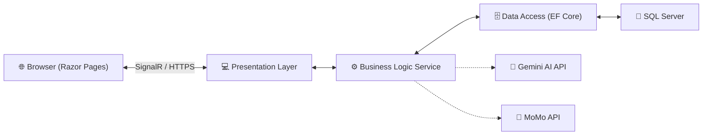

# 🎓 School Management System - PRN222 Final Project


A comprehensive, real-time school management platform designed for Students, Teachers, and Administrators. This project integrates modern web technologies, real-time communication, and AI-driven insights to streamline academic processes.

---

## 🎯 Project Overview
This system provides a full-featured academic management experience, including course registration, gradebook management, real-time chat, and AI-powered educational assistance.

### 🔑 Key Modules
*   **👤 Identity & Access**: Secure authentication with role-based access control (Student, Teacher, Admin).
*   **📝 Academic Management**: Manage Semesters, Programs, Courses, and Class Sections.
*   **📊 Grade Management**: Comprehensive gradebook with audit logs, weighted totals, and grade appeal workflows.
*   **📅 Scheduling**: Real-time class schedules with recurrence support and teacher overrides.
*   **💬 Real-time Communication**: Chat rooms for classes/courses and instant notifications powered by SignalR.
*   **💳 Finance & Payment**: Integrated Student Wallet with MoMo Payment Gateway for tuition fee handling.
*   **🤖 AI Integration**: Intelligent chatbot and analytics using Google Gemini AI.

---

## 🏗 System Architecture
The project follows a **Layered Architecture** (Social/N-Tier) to ensure separation of concerns and maintainability.

### 📂 Folder Structure
*   `Presentation/`: ASP.NET Core Razor Pages (Frontend & UI Logic).
*   `BusinessLogic/`: Application services, business rules, and mapping (DTOs).
*   `DataAccess/`: Data persistence, Repositories, and Entity Framework Core DbContext.
*   `BusinessObject/`: Domain models (Entities) and shared Enums.

### 🔄 Data Flow


---

## 🧰 Technology Stack
*   **Frontend**: Razor Pages, vanilla CSS, JavaScript, SignalR.
*   **Backend**: .NET 8 Core, C#.
*   **Database**: SQL Server.
*   **ORM**: Entity Framework Core (Database-First approach).
*   **AI**: Google Gemini Pro (v1.5/2.0 API).
*   **Payment**: MoMo Payment Gateway Integration.
*   **Reporting**: CSV & XSLX data export.

---

## ⚙️ Setup Guide

### 1️⃣ Prerequisites
- [.NET 8.0 SDK](https://dotnet.microsoft.com/download/dotnet/8.0)
- [SQL Server](https://www.microsoft.com/en-us/sql-server/sql-server-downloads) (Express or LocalDB)
- [Visual Studio 2022](https://visualstudio.microsoft.com/vs/) or [VS Code](https://code.visualstudio.com/)

### 2️⃣ Clone the Repository
```bash
git clone https://github.com/PRN222-SE1815/PRN222-FinalProject.git
cd PRN222-FinalProject
```

### 3️⃣ Database Configuration
1. Open **SQL Server Management Studio (SSMS)**.
2. Open and execution the script: `PRN222_G5_finalproject.sql` to create the database and seed initial data.
3. Update the connection string in `Presentation/appsettings.json`:
   ```json
   "ConnectionStrings": {
     "DefaultConnection": "Server=YOUR_SERVER_NAME;Database=SchoolManagementDb;Trusted_Connection=True;TrustServerCertificate=True;"
   }
   ```

### 4️⃣ Configure Environment Variables
Inside `appsettings.json`, fill in your API keys for full functionality:
```json
"Gemini": {
  "ApiKey": "YOUR_GEMINI_API_KEY"
},
"MoMo": {
  "AccessKey": "YOUR_MOMO_ACCESS_KEY",
  "SecretKey": "YOUR_MOMO_SECRET_KEY"
}
```

### 5️⃣ Run the Project
```bash
cd Presentation
dotnet run
```
Then navigate to `https://localhost:7143` (or the port specified in your console).

---

## 🗂 Sample Data & Demo
The database is pre-seeded with the following test accounts:

| Role | Username | Password |
| :--- | :--- | :--- |
| **Admin** | `admin` | `123456` |
| **Teacher** | `teacher1` | `123456` |
| **Student** | `student1` | `123456` |

> [!NOTE]
> All passwords are encrypted using BCrypt. The default seed password for all accounts is `123456`.

---

## 📦 Useful Commands
- **Build Solution**: `dotnet build`
- **Run Application**: `dotnet run --project Presentation`
- **Clean Solution**: `dotnet clean`
- **Export Schema (if needed)**: `dotnet ef dbcontext scaffold`

---

## 🧪 Troubleshooting
*   **Database Connection Failed**: Ensure SQL Server is running and your `appsettings.json` connection string matches your server instance (e.g., `Server=.` or `Server=localhost`).
*   **SignalR Connection Issues**: If real-time features don't work, ensure you are using `HTTPS` as modern browsers block SignalR over unsecure `HTTP`.
*   **Missing Dependencies**: Run `dotnet restore` from the root directory to fix missing NuGet packages.
*   **AI Feature Errors**: Verify that your Google Gemini API key is active and has sufficient quota.

---
*Created by Group 5 - PRN222 Final Project*
